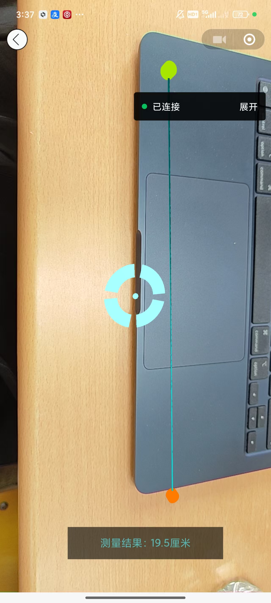

# display and codes

{: .note }
> function of our ar_face

---




{: .warning }
> AR测量关键代码(完整代码请参考顶部提供的github仓库链接)

```js
function moveTo(position) {

		point1.copy(position);
		matrix1.lookAt(point2, point1, up);

		point2.copy(position);
		matrix2.copy(matrix1);

	}

	function lineTo(position) {

		point1.copy(position);
		matrix1.lookAt(point2, point1, up);

		stroke(point1, point2, matrix1, matrix2);

		point2.copy(point1);
		matrix2.copy(matrix1);

	}

	function setSize(value) {

		size = value;

	}

	//

	let count = 0;

	function update() {

		const start = count;
		const end = geometry.drawRange.count;

		if (start === end) return;

		positions.updateRange.offset = start * 3;
		positions.updateRange.count = (end - start) * 3;
		positions.needsUpdate = true;

		normals.updateRange.offset = start * 3;
		normals.updateRange.count = (end - start) * 3;
		normals.needsUpdate = true;

		colors.updateRange.offset = start * 3;
		colors.updateRange.count = (end - start) * 3;
		colors.needsUpdate = true;

		count = geometry.drawRange.count;

	}

	return {
		mesh: mesh,
		moveTo: moveTo,
		lineTo: lineTo,
		setSize: setSize,
		update: update
	}

}


```