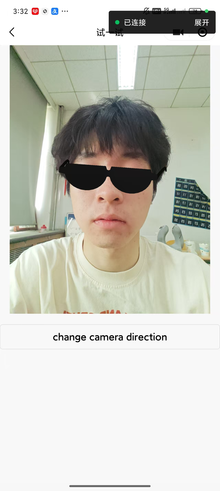

{: .note }
> function of our ar_face
---




{: .warning }
> 人脸检测关键代码

```js
  initFaceDetect_callback(predictions) {
        if (predictions && predictions.length > 0) {
            var canvasWidth = this.frameWidth;
            var canvasHeight = this.frameHeight;
            var prediction = predictions[0]

            // set the rotation and position of the 3d model.    
            model.setModel(prediction,
                canvasWidth,
                canvasHeight);
        } else {
            var message = 'No results.';
            wx.showToast({
                title: message,
                icon: 'none'
            });
        }
    },
    startTacking() {
        var _that = this;
        var count = 0;
        const context = wx.createCameraContext();

        // real-time
        listener = context.onCameraFrame(function (res) {
            // this is throttling
            if (count < cameraFrameMax) {
                count++;
                return;
            }
            count = 0;
            console.log('onCameraFrame:', res.width, res.height);
            const frame = {
                // the data type is ArrayBuffer
                data: res.data,
                width: res.width,
                height: res.height,
            };
            _that.frameWidth = frame.width
            _that.frameHeight = frame.height
            // process
            face.faceDetect(frame, 0);
        });
        // start
        listener.start();
        console.log('startTacking', 'listener is start');
    },
    stopTacking() {
        if (listener) {
            listener.stop();
        }
    },
    changeDirection() {
        var status = this.data.devicePosition;
        if (status === 'back') {
            status = 'front';
        } else {
            status = 'back';
        }
        this.setData({
            devicePosition: status,
        });
    }
})

```