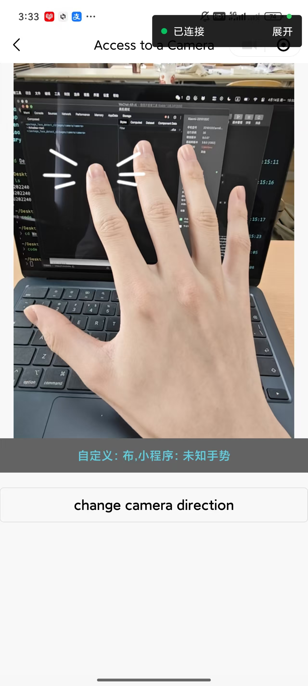

# display and codes

{: .note }
> function of our ar_hands

---




{: .warning }
> 手部检测 关键代码(完整代码请参考顶部提供的github仓库链接)

```js
function handDetect(frame, sourceType) {
  if (!isInitOk) {
    return
  }

  start_time = new Date()

  session.detectHand({
    frameBuffer: frame.data,
    width: frame.width,
    height: frame.height,
    scoreThreshold: 0.5, // 评分阈值。
    // 官方文档没有写
    // sourceType: sourceType, // 正常情况传入 1 即可。当输入的图片是来自一个连续视频的每一帧图像时，sourceType 传入 0 会得到更优的效果。
    // modelMode: 1, // 0、1、2 分别表示小、中、大等模型。
    // 算法模式：
    // 0, 检测模式，输出框和点；
    // 1，手势模式，输出框和手势分类；
    // 2，同时具备0和1，输出框、点、手势分类。
    algoMode: 0, 
  })

}

function stopHandDetect() {
  session.destroy()
  if (session) {
    session = null
  }
  console.log('stopHandDetect')
}

module.exports = { initHandDetect, handDetect, stopHandDetect }

```