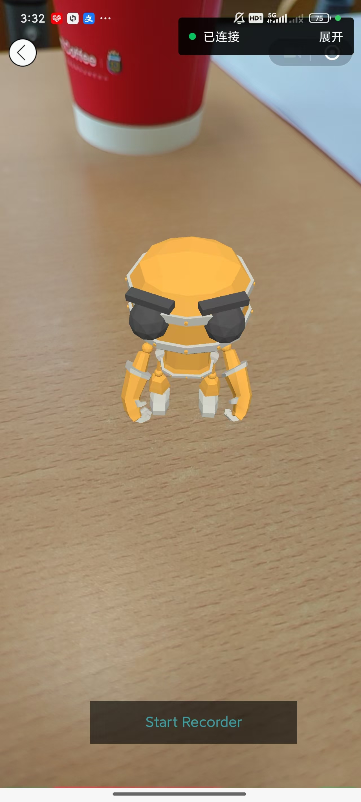

# display and code

{: .note }
> function of our ar_robots

---




## 具体代码实现

{: .warning } 
> 获取3d模型(完整代码请参考首页提供的github仓库链接)

```js
onReady() {
    console.log('onReady')

    // 获取小程序右上角胶囊按钮的坐标，用作自定义导航栏。
    const menuButton = wx.getMenuButtonBoundingClientRect()

    this.setData({
      // 胶囊按钮与手机屏幕顶端的间距
      menuButtonTop: menuButton.top,
      // 胶囊按钮的高度
      menuButtonHeight: menuButton.height,
    })

    // 获取画布组件
    wx.createSelectorQuery()
      .select('#' + canvasId)
      .node()
      .exec(res => {
        // 画布组件
        canvas1 = res[0].node
        // 启动AR会话
        cameraBusiness.initEnvironment(canvas1)
        // 加载3D模型
        cameraBusiness.loadModel(robotUrl, function (model, animations) {
          // 创建AR的坐标系
          cameraBusiness.initWorldTrack(model)
          // 加载3D模型的动画
          cameraBusiness.createAnimation(model, animations, 'Dance')
        })
        // webgl画面录制器
        recorder = wx.createMediaRecorder(canvas1, {
          fps: recorderFPS,
        })

      })


  },
```
---

{: .warning }
> 机器人各项参数代码设置(完整代码请参考首页提供的github仓库链接)

```js
const cameraBusiness = require('../../utils/cameraBusiness.js')
// 画布id
const canvasId = 'canvas1';
// 机器人模型，带动画。
const robotUrl = 'https://m.sanyue.red/demo/gltf/robot.glb';
// webgl画面录制器的帧数
const recorderFPS = 30
// webgl画面录制器的最长录制时间（单位：秒）
const recorderMaxTime = 5
// 画布组件
var canvas1;
// webgl画面录制器
var recorder;
// 是否在录制webgl画面
var isRecording = false
```


